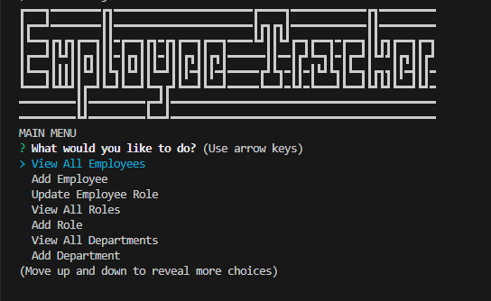

# Employee-Tracker

## Visuals

  
[Video Demonstration](https://drive.google.com/file/d/1fFEdlTpOPgS8g15LU1E_pNTy6qQ5SQyG/view)

## Description
  This application is a simple database that a company can use to track and update information regarding employees, departments, and roles.

## Table of Contents
- [Employee-Tracker](#employee-tracker)
  - [Visuals](#visuals)
  - [Description](#description)
  - [Table of Contents](#table-of-contents)
  - [Installation](#installation)
  - [Usage](#usage)
  - [License](#license)
  - [Initializing](#initializing)
  - [Repo](#repo)
  - [Contributors](#contributors)

## Installation
Packages required to use this application: Node.js

## Usage
This application should be used by a company in order to quickly and easily updated and store information about their employees, departments, and roles.

## License
MIT

## Initializing
To run a this application, run this command: node index.js

## Repo

Link to the application's repo: [Employee-Tracker](https://github.com/Steveb175/Employee-Tracker)

## Contributors
Link to creator's GitHub: [Steveb175](https://github.com/Steveb175)

